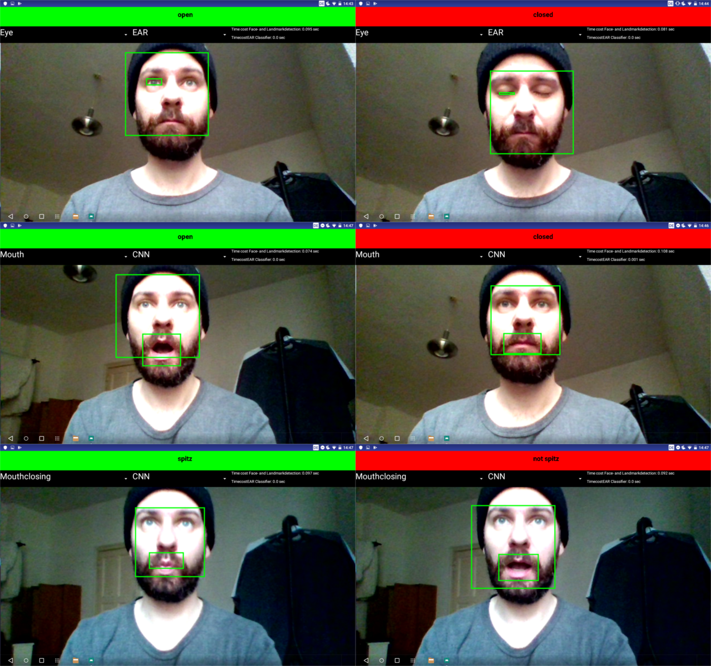

# FaceLandmarkAnalyzer-App

Android Application which analyze if your eyes or mouth are open or closed and if your lips are closed or not. You can choose between Convolutional Neural Networks or some self developed algorithms 
for classification

### Implematation details
* The fast version of DLib for Android is used for Face- and Landmark Detection. [fast-face-android](https://github.com/gicheonkang/fast-face-android)
* eye aspect ratio (EAR), introduced by Soukupová and Čech are used for Classification of open or closed eye
* for mouth classification own algorithms were developed following EAR.
* TensorFlow Lite and some selftrained MobileNets are used for classification

### Grap the source
`$ git clone https://github.com/TrueBypass/FaceLandmarkAnalyzer.git`

### Demo

### Build

#### Android app
* Open Android studio to build

### License
[License](LICENSE.md)
